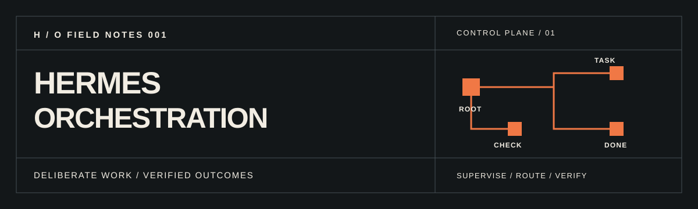

# Hermes Orchestration

[](https://github.com/Vloods/hermes-orchestration/actions/workflows/check.yml)

**A reproducible, safety-first starter for supervising Hermes Agent work.** One default agent makes decisions; short-lived delegated children return bounded results; a separate Kanban board carries durable tasks across named profiles. The repo supplies minimal configuration, a project policy, an offline-tested renderer, and an architecture diagram—not another agent runtime.

[Quick start](#from-zero-to-a-local-board) · [Architecture](docs/architecture.md) · [Security](docs/security.md) · [Troubleshooting](docs/troubleshooting.md) · [Русский](README.ru.md)


> Community starter; **not affiliated with or endorsed by Nous Research**. Hermes Agent and its documentation belong to their respective maintainers. MIT applies to the original files in this repository, not to upstream Hermes Agent. No personal config, credentials, memories, or session data are included.

## What it reproduces

- Default profile: `gpt-6-astra` / low reasoning; a `gpt-6-sol` / medium delegated child, maximum 3 concurrent children, depth 1, `orchestrator_enabled: false`.
- Ten auxiliary paths (`vision`, `compression`, `skills_hub`, `approval`, `mcp`, `title_generation`, `triage_specifier`, `kanban_decomposer`, `profile_describer`, `curator`) on `gpt-6-luna` / low. These may be called independently of the main agent; no performance or cost claim is implied.
- Separate `solver` profile on `gpt-6-sol` / high, for difficult correctness work. Merely describing a solver does not route calls to it; assign tasks explicitly using the board or other real profile route.
- Gateway-embedded Kanban dispatcher enabled, with deliberately empty `orchestrator_profile` / `default_assignee`. This is **not** automatic routing to the solver. Built-in auto-decomposition is **off in this starter** until you deliberately opt in (upstream may default to on).
- Approval-safe starter: delegated dangerous commands are auto-denied (`subagent_auto_approve: false`). The observed local configuration used `true`; see [security and parity opt-in](docs/security.md) before changing it.

Model IDs are an illustrative snapshot observed on one installation, **not universal entitlements**; the source revision linked below documents the runtime checked, not guaranteed access to those IDs. Choose a provider and models your account actually supports; override all four slots during rendering. No credential, provider base URL, or fixed `model.api_mode` is shipped: the installed runtime resolves the wire protocol for the selected provider/model. Check its effective routing after substitution.

## From zero to a local board

1. Install Hermes Agent using the [official installation guide](https://hermes-agent.nousresearch.com/docs/getting-started/installation). For a supported Linux/macOS/WSL2 CLI install, the official command is `curl -fsSL https://hermes-agent.nousresearch.com/install.sh | bash`; read the upstream script and platform notes before running network-sourced code. Windows and desktop installation have separate upstream instructions. Verify `hermes --version`.
2. Clone **this repository** and choose a new absolute home. For an isolated test on POSIX shells:

   ```bash
   git clone https://github.com/Vloods/hermes-orchestration.git
   cd hermes-orchestration
   SANDBOX="$(mktemp -d)/hermes-home"
   python3 scripts/render.py --home "$SANDBOX"                  # dry-run; writes nothing
   python3 scripts/render.py --home "$SANDBOX" --apply          # creates three minimal YAML files
   HERMES_HOME="$SANDBOX" hermes profile list
   HERMES_HOME="$SANDBOX" hermes config get model
   ```

   If those model IDs are unavailable, render into a **new** home with `--provider YOUR_PROVIDER --primary-model YOUR_MODEL --delegate-model YOUR_MODEL --aux-model YOUR_MODEL --solver-model YOUR_MODEL`. The renderer refuses pre-existing destination files by default; `--backup-existing --apply` replaces them **after making `.backup` copies**, but this is not a merge and could remove existing customizations. Prefer a fresh home. The script requires explicit absolute paths and does not infer your live `~/.hermes`.
3. Authenticate interactively with `HERMES_HOME="$SANDBOX" hermes setup` (or `HERMES_HOME="$SANDBOX" hermes setup --portal` if choosing Nous Portal). This starter never copies `.env`, OAuth tokens, auth pools, or a preconfigured login. The installed runtime can let a named profile fall back to the **sandbox root** `auth.json` per provider when it lacks its own credentials; profile auth is not a hard security boundary. Root setup may therefore suffice for `solver` on the same provider, but confirm its effective access before dispatch; use `HERMES_HOME="$SANDBOX" hermes --profile solver auth ...` for profile-specific auth if needed (see `hermes auth --help`). Confirm model/provider availability and inspect the config if setup edits it.
4. Place policy into an explicit **project** if desired: `python3 scripts/render.py --home "$SANDBOX" --project /absolute/path/to/your/project` previews the writes, including `.hermes.md`; add `--apply` only when the project destination is clear. The policy is **not** installed globally. If the home already has rendered files, copy `policy/.hermes.md` into your project yourself rather than using `--backup-existing` merely to install policy; never blindly overwrite a project policy.
5. Once authenticated, initialize the board, then run the gateway **in a separate foreground terminal**. Do not install a background service for a throwaway home: service install/start can change persistent host state, and service naming/ownership varies by platform and installed version.

   ```bash
   HERMES_HOME="$SANDBOX" hermes kanban init
   HERMES_HOME="$SANDBOX" hermes gateway run   # separate terminal; leave running
   ```

   In the original terminal, after the gateway is running (the following card can make a paid model call):

   ```bash
   HERMES_HOME="$SANDBOX" hermes gateway status
   HERMES_HOME="$SANDBOX" hermes kanban create "Inspect a bounded task" --assignee solver --body "Return evidence and limitations; do not edit files." --completion-contract local-only
   HERMES_HOME="$SANDBOX" hermes kanban list
   ```

   Do **not** create the sample card until auth works: dispatch triggers a paid/limited model call. This repository's test suite does not run it. `ready` cards wait without a running gateway. Inspect `HERMES_HOME="$SANDBOX" hermes kanban show TASK_ID` and `HERMES_HOME="$SANDBOX" hermes kanban runs TASK_ID` for the actual outcome, never infer success from creation. If you later need a persistent service, inspect the installed version's service label/unit and existing host gateway before using `gateway install`.

You can use `HERMES_HOME="$SANDBOX" hermes kanban dispatch --dry-run` to check readiness without spawning a worker. For manual routing, set `--assignee` on every card. If you enable automatic triage later, inspect profile descriptions and `auxiliary.kanban_decomposer` first: the built-in decomposer is an auxiliary call; `kanban.orchestrator_profile` controls ownership of the root after fan-out, **not** the decomposition prompt/model.

## Repository map

| Path | Purpose |
| --- | --- |
| `templates/` | Minimal default and solver YAML + solver description; no secret state |
| `policy/.hermes.md` | Compact project-local role/verification policy used by the renderer |
| `policy/reference.hermes.md` | Full original orchestration policy; copy as your project’s `.hermes.md` for policy parity |
| `scripts/render.py` | Dry-run by default; explicit destinations, refusal/backup logic |
| `tests/` | Offline positive, negative, and sandbox checks |
| `docs/` | Architecture, security, troubleshooting; Russian setup notes |
| `assets/` | Original editable SVG brand/banner and diagram |

Run `python3 -m unittest discover -s tests -v`. The same offline checks run in GitHub Actions; they do not authenticate, spend inference credits, start a gateway, or change a live Hermes home.

## Scope and provenance

Behavior and command syntax were checked against the Hermes Agent source at [`4a2bd7406ee3e09bd30a42cf9a7b970aac6edf9e`](https://github.com/NousResearch/hermes-agent/commit/4a2bd7406ee3e09bd30a42cf9a7b970aac6edf9e) (public GitHub API resolved the commit) and the upstream [installation](https://hermes-agent.nousresearch.com/docs/getting-started/installation) and [Kanban reference](https://hermes-agent.nousresearch.com/docs/user-guide/features/kanban). `git ls-remote` does not enumerate arbitrary non-ref commits, so the API was used to confirm this SHA. Interfaces can change; consult [current Hermes docs](https://hermes-agent.nousresearch.com/docs) before adapting the starter to another release. The renderer is tested offline, **not** an end-to-end paid worker run.
