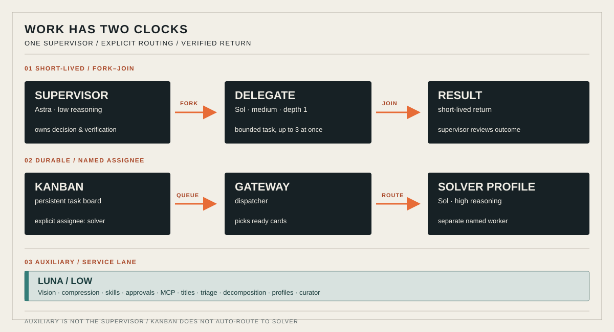

# Роли, безопасность и диагностика

`delegate_task` — краткий синхронный вызов дочернего агента с возвратом результата супервизору; Kanban — постоянная доска для задач, исполняемых назначенным профилем через gateway. Супервизор отвечает за конечный результат. `solver` (high reasoning) выбирается только явным назначением; вспомогательные вызовы `luna` — отдельный канал, не ещё один супервизор.

## Установка

Для уже установленного Hermes и новой установки есть отдельные маршруты в [подробной инструкции](setup.md). Стандартная цель — `~/.hermes`, а не временная песочница. Установите PyYAML в локальное окружение: `python3 -m venv .venv && .venv/bin/python -m pip install -r requirements.txt`. Запустите `.venv/bin/python scripts/render.py` для предпросмотра и повторите с теми же аргументами и `--apply` только после проверки. Используйте параметры `--provider`, `--primary-model`, `--delegate-model`, `--aux-model`, `--solver-model`, если модели из примера недоступны. Скрипт объединяет YAML-рекурсивно, меняя свои ключи и сохраняя посторонние настройки/секреты; изменяемые файлы резервируются. Форматирование и комментарии YAML могут измениться — исходник остаётся в `.backup`. Существующее описание профиля `solver` не переписывается, но его config объединяется и резервируется. Проектный `.hermes.md` при конфликте не перезаписывается.

Авторизуйтесь через `hermes setup`; учётные данные не поставляются. Профиль может получить доступ к корневой авторизации того же дома — это не граница безопасности. Критические правила проекта переносите в тело карточки: изолированное рабочее пространство может не видеть родительский `.hermes.md`. Автоматическая декомпозиция отключена, опасные команды дочерних агентов не разрешаются автоматически. Опция `kanban.orchestrator_profile` не меняет модель декомпозера (`auxiliary.kanban_decomposer`).

После настройки авторизации и проверки существующей службы: `hermes kanban init`, в отдельном терминале `hermes gateway run`, затем `hermes gateway status` и `hermes kanban dispatch --dry-run`. Карточка с `--assignee solver` может вызвать платную модель; проверяйте результат через `hermes kanban show TASK_ID` и `hermes kanban runs TASK_ID`. Тесты: `.venv/bin/python -m unittest discover -s tests -v` — только временные фикстуры, без обращения к живому дому или модели.

Источники по поведению Hermes: [Kanban](https://hermes-agent.nousresearch.com/docs/user-guide/features/kanban), [профили](https://hermes-agent.nousresearch.com/docs/user-guide/profiles), [установка](https://hermes-agent.nousresearch.com/docs/getting-started/installation). Проверяйте свою версию через `hermes --help`.
